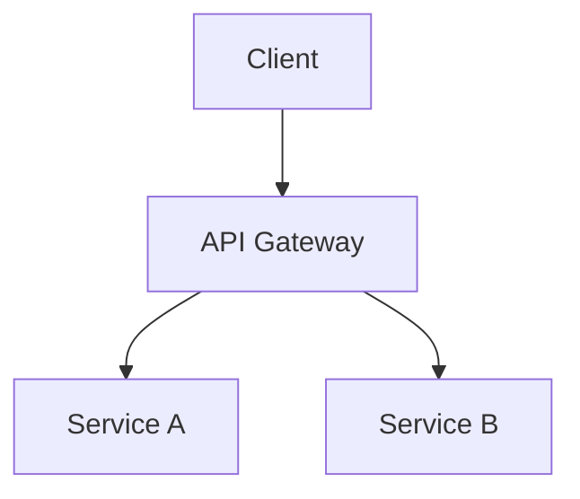

# Commande: /architect

Analyse architecturale approfondie pour les décisions techniques majeures.

ultrathink

## Argument

$ARGUMENTS = Question architecturale ou décision technique

## Quand utiliser

- Choix de stack technique
- Design de nouveaux systèmes
- Évaluation de migrations
- Scalabilité et performance
- Patterns et anti-patterns
- Trade-offs techniques

## Workflow

### Phase 1: Compréhension du contexte

**Questions à explorer** :
- Quel problème essaie-t-on de résoudre ?
- Quelles sont les contraintes (budget, temps, équipe) ?
- Quel est l'état actuel de l'architecture ?
- Quels sont les besoins futurs prévisibles ?

**Exploration** :
- `explore-codebase` : Architecture actuelle
- `explore-db` : Structure des données
- `websearch` : Patterns et solutions du marché

### Phase 2: Analyse des options

Pour chaque option architecturale :

```markdown
### Option A: [Nom]

**Description** :
[Explication de l'approche]

**Architecture diagram** (Mermaid) :


**Avantages** :
- ✅ [Avantage 1]
- ✅ [Avantage 2]

**Inconvénients** :
- ❌ [Inconvénient 1]
- ❌ [Inconvénient 2]

**Complexité** : [1-5] ⭐
**Risque** : [Low/Medium/High]
**Effort** : [S/M/L/XL]
**Maintenabilité** : [1-5] ⭐
```

### Phase 3: Critères d'évaluation

| Critère | Poids | Option A | Option B | Option C |
|---------|-------|----------|----------|----------|
| Performance | 25% | 4/5 | 3/5 | 5/5 |
| Maintenabilité | 20% | 5/5 | 3/5 | 4/5 |
| Scalabilité | 20% | 3/5 | 5/5 | 4/5 |
| Coût | 15% | 4/5 | 2/5 | 3/5 |
| Time-to-market | 10% | 5/5 | 2/5 | 3/5 |
| Sécurité | 10% | 4/5 | 4/5 | 4/5 |
| **Score total** | 100% | **X** | **Y** | **Z** |

### Phase 4: Recommandation

```markdown
## Recommandation architecturale

### Approche recommandée : [Option X]

**Justification principale** :
[Pourquoi cette option est la meilleure dans le contexte actuel]

**Trade-offs acceptés** :
- [Ce qu'on sacrifie et pourquoi c'est acceptable]

### Plan de migration (si applicable)

**Phase 1** : [Description]
- Durée estimée : X
- Risques : [liste]
- Rollback : [stratégie]

**Phase 2** : [Description]
...

### Décisions réversibles vs irréversibles

**Irréversibles (attention requise)** :
- [Décision 1] - Pourquoi irréversible

**Réversibles (moins critique)** :
- [Décision 2] - Comment reverser si besoin

### Points de validation

- [ ] Prototype/POC avant engagement
- [ ] Review par l'équipe
- [ ] Load testing si applicable
- [ ] Security review si applicable
```

### Phase 5: Documentation

Génère un ADR (Architecture Decision Record) :

```markdown
# ADR-XXX: [Titre de la décision]

## Status
Proposed | Accepted | Deprecated | Superseded

## Context
[Pourquoi cette décision est nécessaire]

## Decision
[Ce qui a été décidé]

## Consequences
### Positives
- [Conséquence positive 1]

### Negatives
- [Conséquence négative 1]

### Neutral
- [Impact neutre]

## Alternatives Considered
- [Alternative 1] : Rejeté car [raison]
- [Alternative 2] : Rejeté car [raison]
```

## Patterns architecturaux courants

### Monolithe vs Microservices
- Monolithe : Simple, rapide au début, difficile à scaler
- Microservices : Complexe, flexible, scalable indépendamment

### Synchrone vs Asynchrone
- Sync : Simple, latence directe
- Async : Découplé, résilient, plus complexe

### SQL vs NoSQL
- SQL : ACID, relations, schéma strict
- NoSQL : Flexible, scalable horizontalement, eventual consistency

### Serverless vs Serveurs
- Serverless : Pay-per-use, auto-scale, cold starts
- Serveurs : Contrôle total, coût prévisible, gestion infra

## Anti-patterns à éviter

- **Big Ball of Mud** : Pas d'architecture claire
- **Golden Hammer** : Une solution pour tous les problèmes
- **Premature Optimization** : Optimiser avant de mesurer
- **Accidental Complexity** : Complexité non nécessaire
- **Distributed Monolith** : Microservices mal découpés
